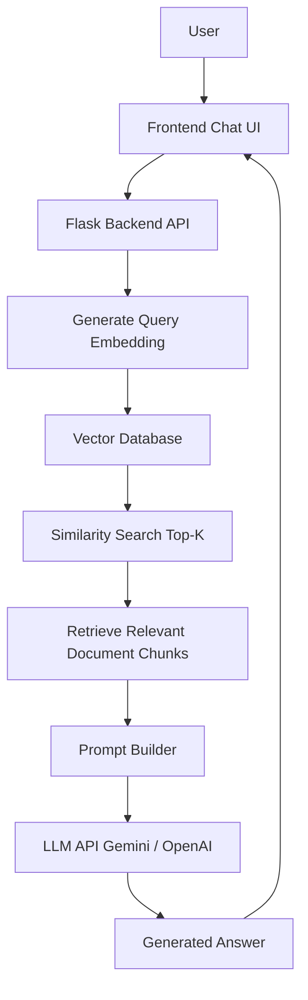

# GenAI-Assistant
The goal of this project is to build a GenAI-powered chat assistant using Retrieval-Augmented Generation (RAG). It converts documents into embeddings, stores them for similarity search, and retrieves relevant context to generate accurate, reliable responses to user queries.

# Tools and Technologies

- **Backend**: Python
- **Frontend**: Basic HTML
- **APIs**:
    - Large Language Model API (OpenAI / Gemini / Claude / Mistral)
    - Embeddings API
- **Vector Storage**: In-memory storage, SQLite, or a simple database
- **Development Environment**: Python 3.x, a code editor (like VSCode), and a web browser

  ### Hardware Requirements

- A computer with internet access
- Sufficient RAM (at least 8GB recommended for smooth operation)


 ### Architecture diagram





### RAG (Retrieval-Augmented Generation) Workflow Explanation

Retrieval-Augmented Generation (RAG) is a technique that improves the accuracy of AI responses by retrieving relevant information from a knowledge base before generating an answer. Instead of relying only on the model’s training data, the system uses external documents to provide grounded responses.

1️. **Document Preparation**

First, the system collects documents that will act as the knowledge base (for example: FAQs, manuals, guides, or company documentation). These documents are then split into smaller chunks (usually 300–500 tokens). Chunking helps the system retrieve more precise information instead of searching through large documents.

2️. **Embedding Generation**

Each document chunk is converted into a vector embedding using an embedding model.
An embedding is a numerical representation of text that captures its semantic meaning.
These embeddings allow the system to compare pieces of text based on meaning rather than exact keywords.

3️. **Vector Storage**

The generated embeddings are stored in a vector database or vector store (such as in-memory storage, SQLite, or specialized vector databases).
Each stored embedding is linked to its original document chunk so it can be retrieved later.

4️. **User Query Processing**

When a user asks a question, the system converts the user query into an embedding using the same embedding model. This ensures that the query and document embeddings exist in the same vector space.

5️. **Similarity Search**

The system performs a similarity search between the query embedding and the stored document embeddings using methods like cosine similarity or dot product.
The system retrieves the top 3 most relevant document chunks that best match the query.

6️. **Context Injection**

The retrieved document chunks are added to the prompt sent to the Large Language Model (LLM). This context helps the model infer the correct information for the question.

7️. **Response Generation**

Finally, the LLM generates a response using the provided context and the user’s question. Because the answer is based on retrieved documents, the response becomes more accurate, reliable, and grounded, reducing hallucinations.

### Embedding Strategy

The embedding strategy defines how documents and user queries are converted into vector representations so that the system can perform accurate semantic search in a Retrieval-Augmented Generation (RAG) system.

1️. **Document Chunking**

Before generating embeddings, documents are divided into smaller chunks (typically 300–500 tokens). Chunking improves retrieval accuracy because smaller text segments are easier to match with user queries. Each chunk should contain meaningful information while maintaining context from the original document.

2️. **Embedding Generation**

Each document chunk is converted into a vector embedding using an embedding model (such as OpenAI, Gemini, or Sentence Transformers). The embedding represents the semantic meaning of the text in numerical form, allowing similar pieces of information to be located through vector similarity.

3️. **Embedding Storage**

All generated embeddings are stored in a vector store, such as in-memory storage, SQLite, or a lightweight vector database. Each embedding is stored along with its corresponding document chunk and metadata (e.g., document title or chunk ID) to allow efficient retrieval later.

4️. **Query Embedding**

When a user submits a query, the system generates an embedding for the query using the same embedding model used for the documents. This ensures both document and query vectors exist in the same embedding space.

5️. **Similarity Search**

The system compares the query embedding with stored document embeddings using similarity metrics such as cosine similarity or dot product. The top 3 most relevant document chunks are retrieved based on the highest similarity scores.

6️. **Threshold Filtering**

A similarity threshold is applied to ensure that only relevant information is used. If no chunk meets the threshold, the system returns a fallback message indicating insufficient information.

This embedding strategy ensures efficient retrieval, improved relevance, and accurate context generation in the RAG-based chat assistant.


### Similarity Search Explanation

Similarity search is a key component of a Retrieval-Augmented Generation (RAG) system. It helps the system find the most relevant document chunks from the knowledge base that match a user’s query based on semantic meaning rather than exact keywords.

1️. **Query Embedding**

When a user asks a question, the system first converts the user query into a vector embedding using the same embedding model that was used for the documents. This ensures that both document embeddings and query embeddings exist in the same vector space.

2️. **Comparing Vectors**

The system then compares the query embedding with all stored document embeddings in the vector database. Instead of comparing text directly, the system compares their numerical vector representations.

3️. **Similarity Calculation**

A mathematical function, such as cosine similarity or dot product, is used to measure how similar two vectors are.


4️. **Top-K Retrieval**

After calculating similarity scores, the system selects the top K most relevant chunks (commonly top 3). These chunks contain the information most likely to answer the user's question.

5️. **Threshold Filtering**

To ensure quality, a similarity threshold is applied. If the similarity score of retrieved chunks is below the threshold, the system may return a fallback response such as “Insufficient information available.”

6️. **Context for LLM**

The retrieved document chunks are then passed to the Large Language Model (LLM) as context. The model uses this context to generate an accurate and grounded response.

In summary, similarity search enables the RAG system to quickly identify relevant information from stored documents, ensuring that the AI assistant provides accurate and context-based answers.


### Prompt Design Reasoning

Prompt design is an important part of a Retrieval-Augmented Generation (RAG) system because it ensures that the Large Language Model (LLM) generates accurate responses based on the retrieved document context rather than relying only on its general knowledge.


## Step-by-Step Instructions


1. **Clone the Repository**:
    
    ```bash
    git clone https://github.com/paridhianant540-gif/GenAI-Assistant-.git
    cd genai_chat_assistant
    ```


2. **Set up Project Environment**:
   
    ```bash
    python -m venv venv
    venv\Scripts\activate
    ```

3. **Install Required Dependencies**:
   
    ```bash
    pip install -r requirements.txt
    ```

4. **Configure Environment Variables**:
   
   Create a .env file in the root directory and add your API key.
    ```bash
    Example:
    GEMINI_API_KEY=your_api_key_here
    ```


5. **Prepare the Knowledge Base**:
   
   Create a docs.json file containing 5–10 documents that will act as the knowledge base.
    ```bash
    [
      {
        "title": "Reset Password",
        "content": "Users can reset their password from Settings > Security."
      }
    ]
    ```

6. **Run the Application**:
   
   Start the Flask backend server.
    ```bash
        python app.py
    
        The server will start locally, usually at:
    
        http://127.0.0.1:5000
    ```

7️. **Open the Chat Interface**:

Open the browser and visit the local URL to access the chat interface.
You can now ask questions, and the assistant will retrieve relevant documents and generate responses using the RAG pipeline.
    
